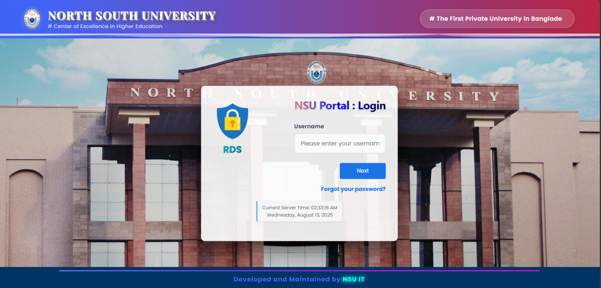
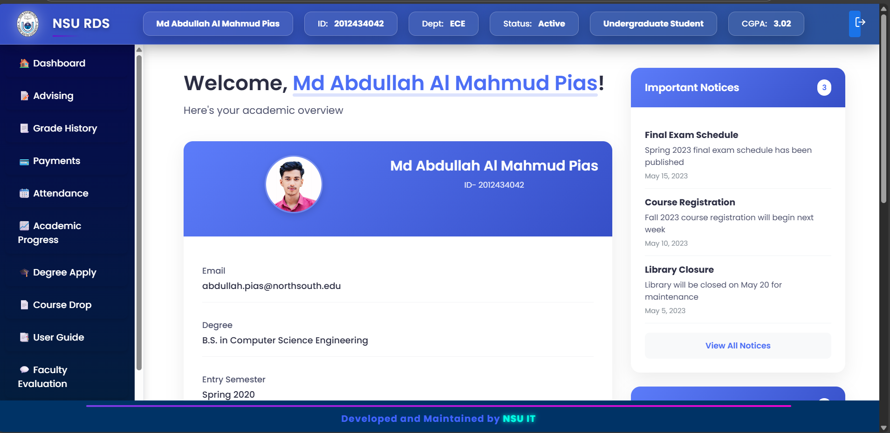
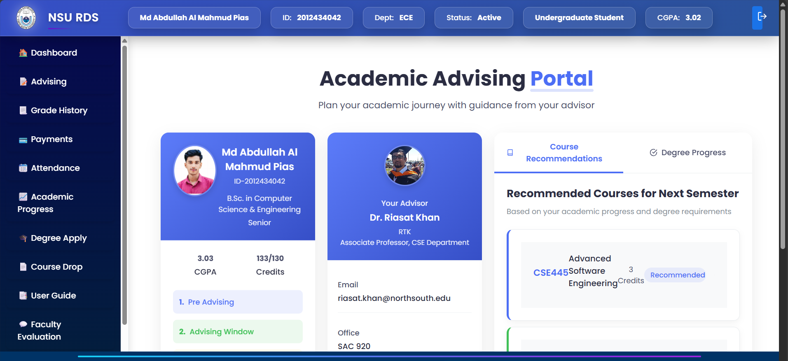
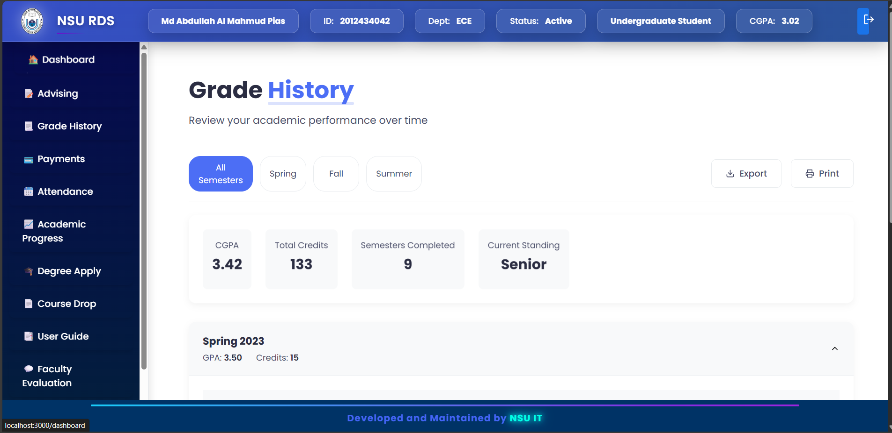
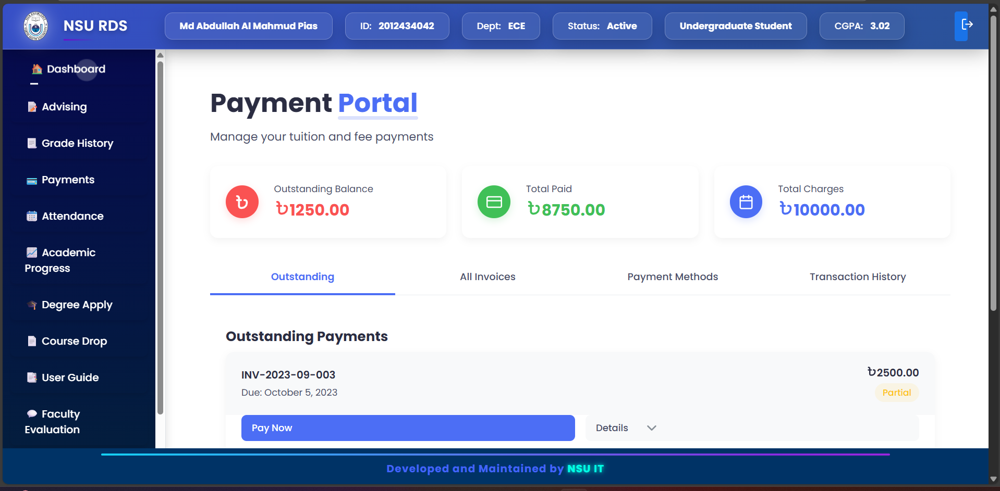
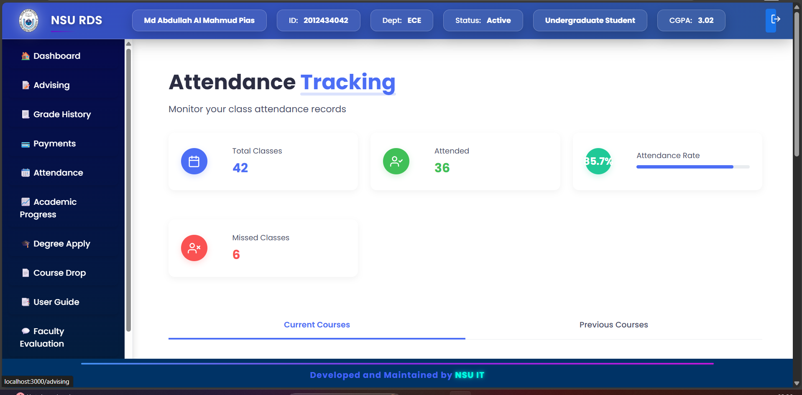
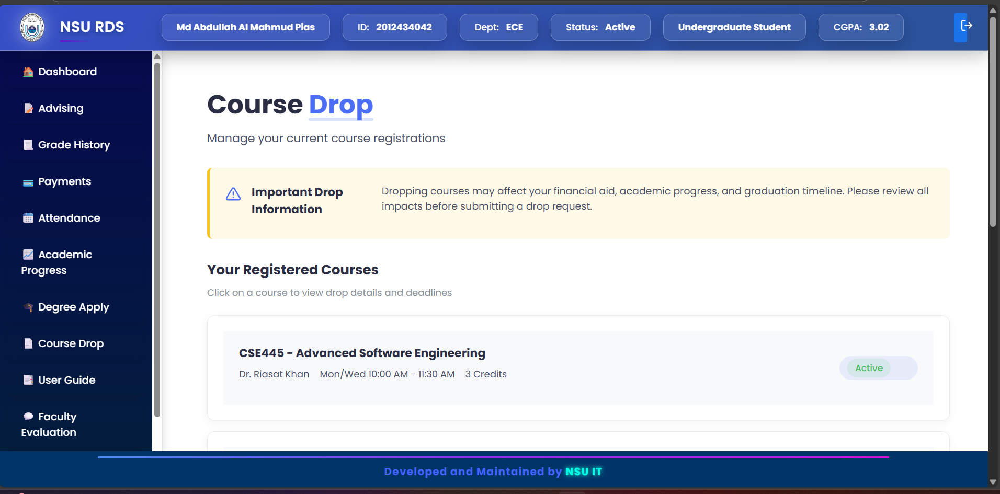

# NSU Research Data System (RDS) 🎓

A real-time research management portal for North South University built with the MERN stack. Streamlines research project lifecycle from submission to publication with secure role-based access.

## 📺 Live Demo

## ✨ Key Features
- **Role-Based Access Control**
  - Admin (IT Staff)
  - Registrar Office
  - Faculty Members
  - Students
- **Research Project Management**
  - Project submission & tracking
  - Document upload/versioning
  - Approval workflows
- **Advanced Analytics**
  - Funding statistics
  - Publication metrics
  - Department-wise reports
- **Security**
  - JWT authentication
  - Data encryption
  - Session management

## 🛠 Tech Stack
**Frontend**  

**Backend**  

**DevOps**  

## 🚢 Deployment
The system is deployed on NSU's secure infrastructure featuring:
- HTTPS encryption
- Load balancing for high availability
- Automated daily backups
- Role-based access control
- Real-time monitoring
## 🖥️ UI Showcase

### Desktop Views

  
  
  
  
  
  
  
  

## 🙏 Acknowledgments
- North South University IT Department
- Faculty Advisory Committee
- Beta Testing Team

## 📬 Contact
**Md Abdullah Al Mahmud Pias**  
📧 Email: [abdullahpias09@gmail.com](mailto:abdullahpias09@gmail.com)  
🔗 LinkedIn: [linkedin.com/in/almahmudpias](https://www.linkedin.com/in/almahmudpias/)  
🐙 GitHub: [github.com/yourusername](https://github.com/yourusername)

---

**Developed for North South University**  
*July 2025 - Present*
# NSU-RDS-Online-Portal
